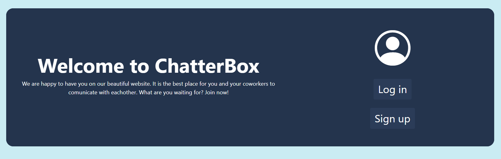
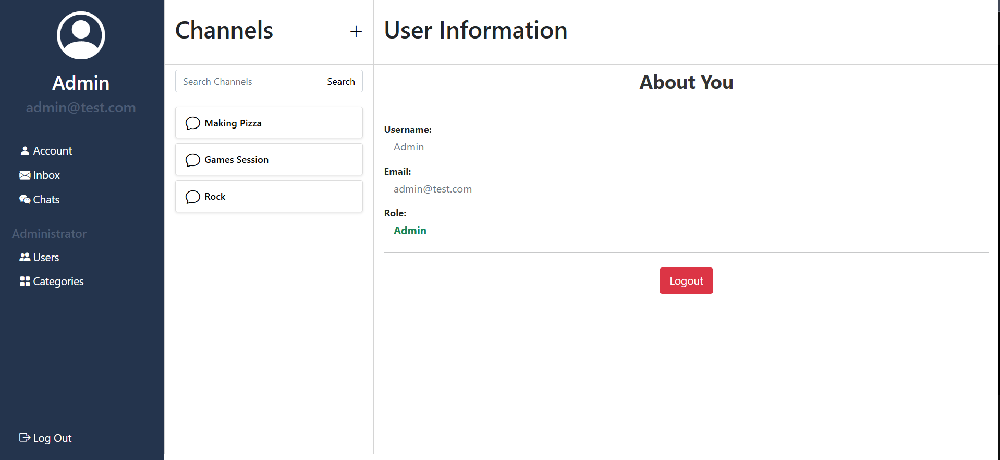
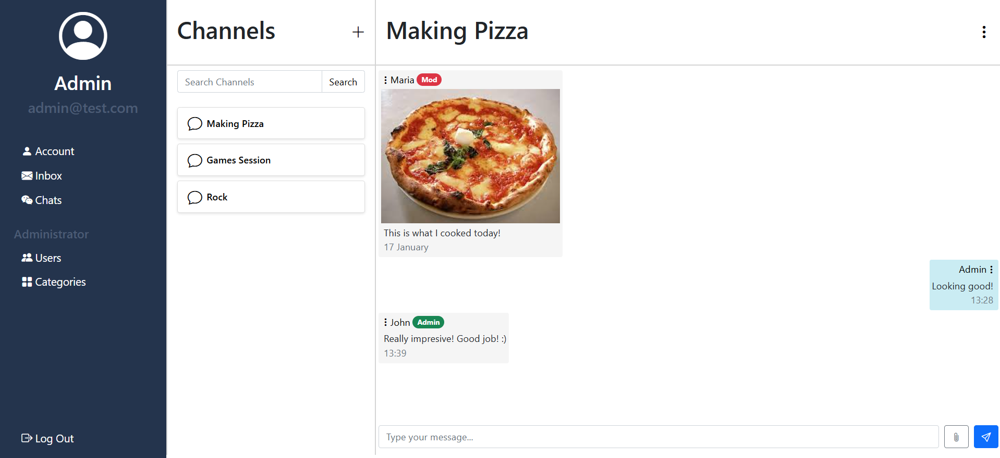

# ChatterBox

### **Table of Context**
- [Description](#description)
- [Features](#features)
- [Gallery](#gallery)

## Description

This chat web application, built using **ASP.NET MVC in Visual Studio**, provides an interactive and customizable communication environment tailored to different user roles. The platform enables efficient creation and management of discussion spaces. Features such as message moderation, channel organization into categories, and a powerful search engine ensure a seamless and well-structured experience for all participants.

## Features

1. Implemented a **role-based system** in the application, allowing users to have different levels of access and responsibilities.

    - At the **application level**, users can be either regular users or administrators, with admins having full control over user management and platform settings;
    - Within **individual channels**, users can take on specific roles, including channel admins, moderators, or regular members;

2. Login / Register system.
   
3. **CRUD operations** on Channels, Messages and Categories.

4. **Multimedia sharing** between users, such as text, images, and videos.

5. A **powerful search engine** that allows users to quickly find channels they have access to.

6. **Invite & Request System** for joining Channels.

    - Users can **request to join** channels, requiring approval from a channel admin or moderator before gaining access;
    - Channel admins can **approve or decline** requests, ensuring better control over who enters the conversation;
    - Existing members with permissions can send invitations to other users, allowing them to join;

7. **Inbox Management** for Invites and Requests.

   - Implemented an **inbox system** where users can track the status of their **join requests** for channels;
   - The inbox also allows users to view **pending invitations** to channels and choose to accept or decline them;

8. Pagination and responsive UI.

## Gallery

### Start Page

    

### User Page

    

### Channel Page

    

